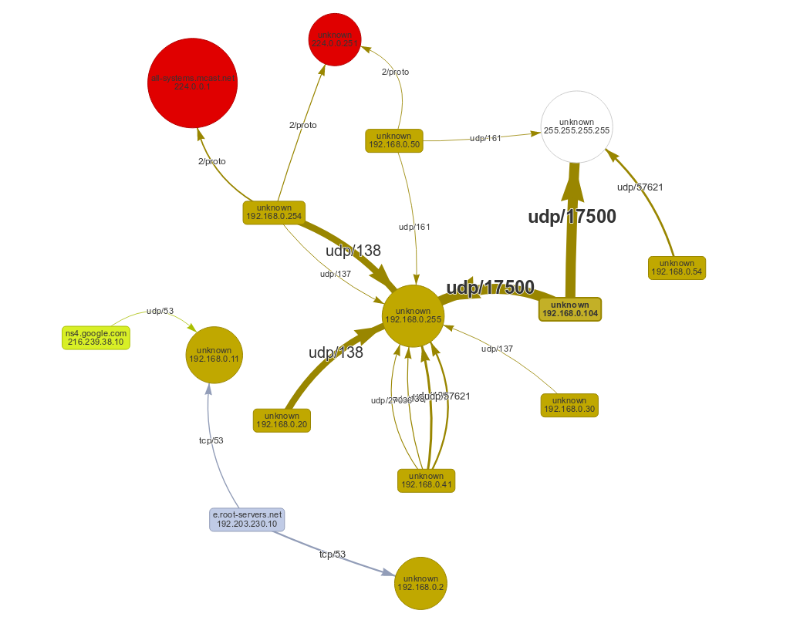
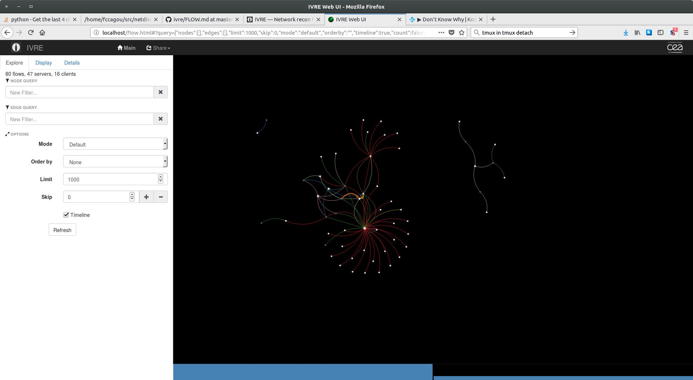
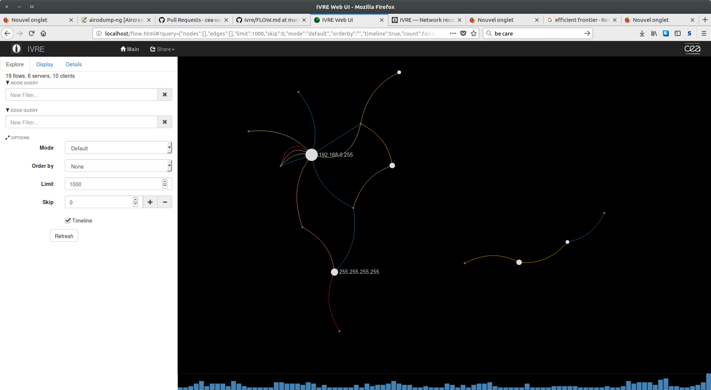

# netdiscoviz
Tool to discover and visualize networks


The current version get logs from iptables and generate js file to use
with [vis.js](http://visjs.org).

To use it, just run :

```

   git clone --recurse https://github.com/fccagou/netdiscoviz
   cd netdiscoviz
   cat tests/input-ipt.log | python ./iptables2visjs.py > data/net.js
   firefox ./index.html

```

You must get a graphe looking like this .




The picture below is from [@IvreRocks](https://ivre.rocks) using [bro capture](https://github.com/cea-sec/ivre/blob/master/doc/FLOW.md)
on 3 sources in the same network.




And how about making an iptables logs parser to [@IvreRocks flow](https://ivre.rocks)?  
Ivre's team was ok and I've done it. It's now [merged](https://doc.ivre.rocks/en/latest/overview/faq.html#how-can-i-configure-iptables-to-get-logs-used-by-flow2db-tool).


Here is the graph with the same input file then the first picture.




Just for fun, use [ivre flowcli](https://github.com/cea-sec/ivre/blob/master/doc/FLOW.md) to generate graph :P

```
    ivre flowcli -s ' ' \
       | awk '{ print  "IN=ivre SRC="$1" DST="$3" SPT= PROTO="$2 }'\
       | sed 's#/# DPT=#' \
       | ./iptables2vis.py > data/net.js

    xdg-open index.html

```

