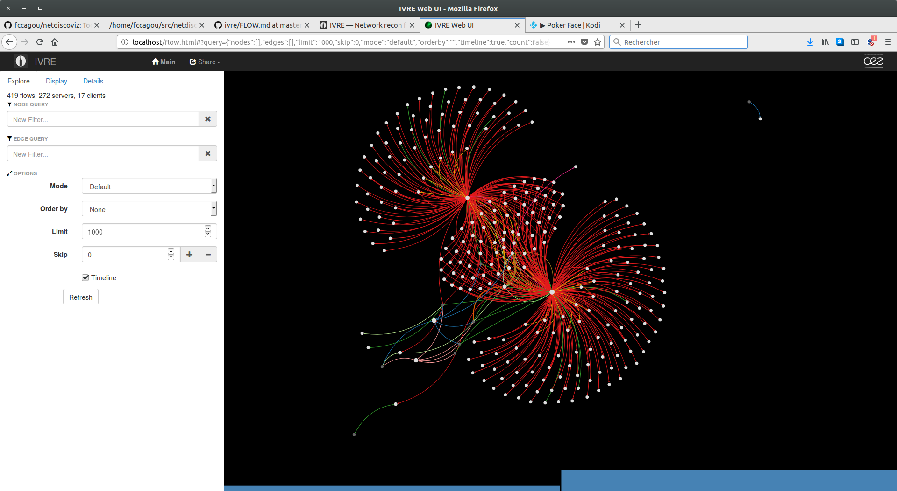

# netdiscoviz
Tool to discover and visualize networks


The current version get logs from iptables and generate js file to use
with [vis.js](http://visjs.org).

To use it, just run :

```

   git clone --recurse https://github.com/fccagou/netdiscoviz
   cd netdiscoviz
   cat tests/input-ipt.log | python ./iptables2visjs.py > data/net.js
   firefox ./index.html

```

You must get a graphe looking like this .


The picture below is from [@IvreRocks](https://ivre.rocks) using [bro capture](https://github.com/cea-sec/ivre/blob/master/doc/FLOW.md)
on 3 sources in the same network.




TODO: how to make an iptables logs parser to [@IvreRocks flow](https://ivre.rocks). 

